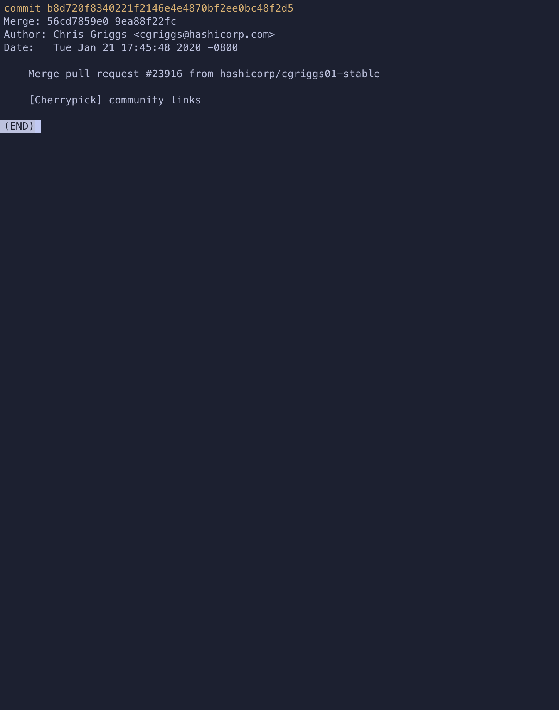
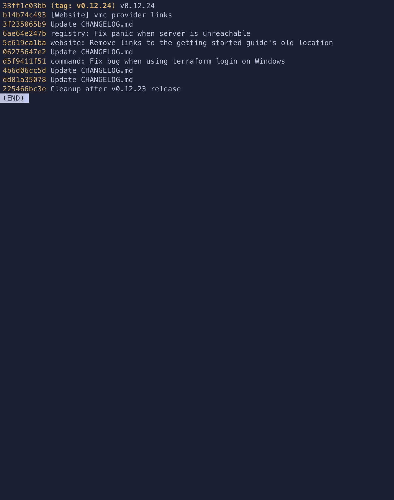
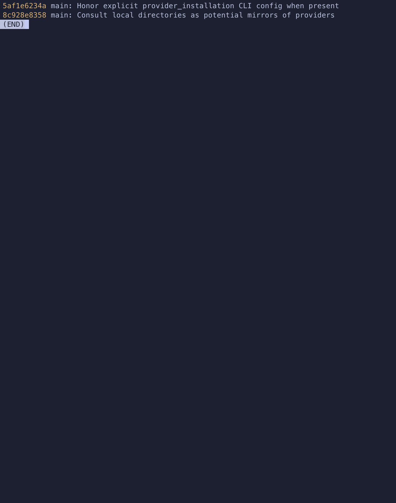
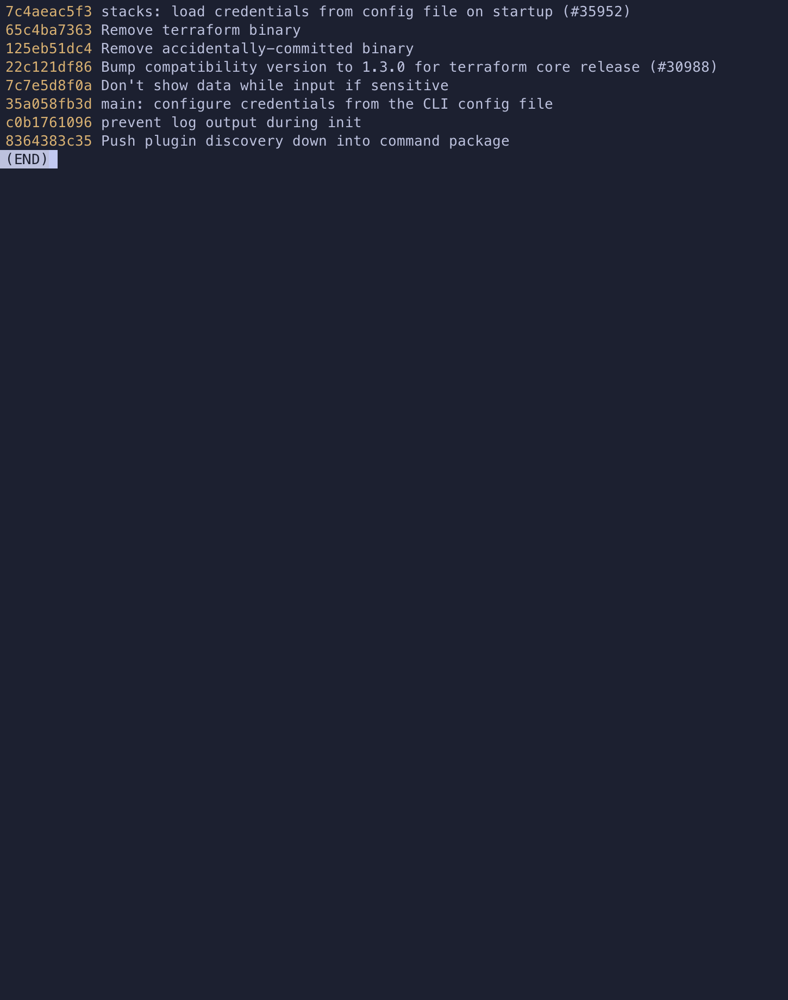
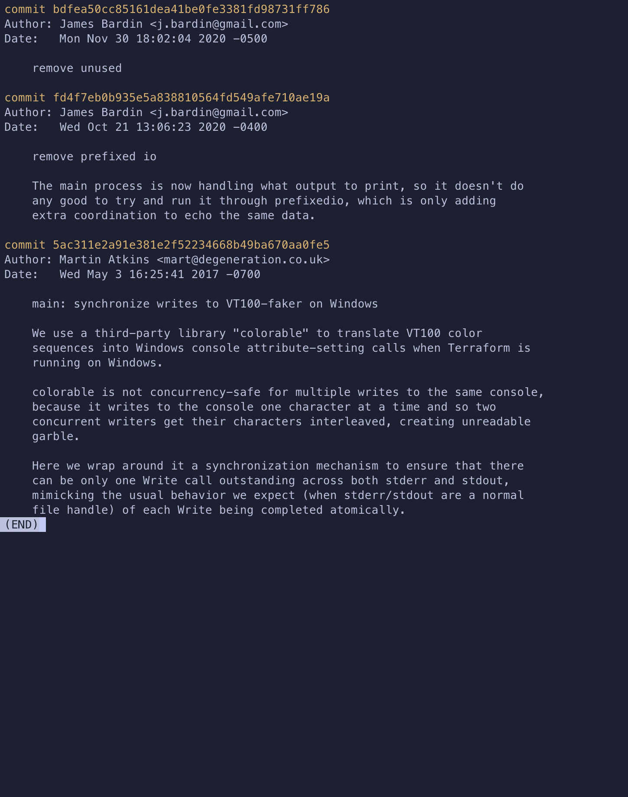

# Домашнее задание Git Захаров Роман 

## 1. Коммит aefea

---

## 2. Коммит 85024d3

---

## 3. Родители коммита b8d720

---
## 4. Перечислите хеши и комментарии всех коммитов, которые были сделаны между тегами v0.12.23 и v0.12.24.

----

## 5 Найти коммит, где была создана функция providerSource

---

## 6 Найти все коммиты, где изменялась функция globalPluginDirs

---

## 7 Кто автор функции synchronizedWriters

---
